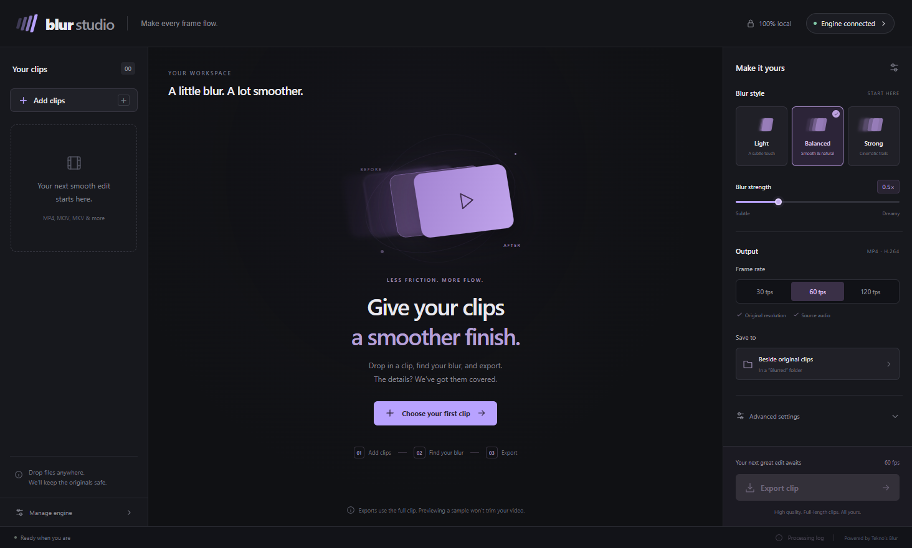

# Motion Blur

A simple Windows desktop interface for Tekno's Blur: **add clips → choose blur →
preview → export**. The current purple and graphite UI is retained.



## Download and install

Open [GitHub Releases](https://github.com/Virojet/motion-blur-studio/releases/latest)
and download **Motion-Blur-1.1.0-Setup-Windows-x64.exe**.

1. Run the setup wizard. It installs the editor for your Windows user, with
   Desktop and Start menu shortcuts. Administrator privileges are not required.
2. Setup reuses an existing complete Blur installation. If none is found, it
   downloads the official **Blur v2.45 Windows installer**, verifies its pinned
   SHA-256, and installs the engine in `%LOCALAPPDATA%\Programs\Motion Blur Engine`.
   This first engine installation needs Internet and downloads about **180 MB**.
3. Open **Motion Blur**, add clips, choose your preset, and generate a preview.
4. Export your clips. They go to a `Blurred` folder beside each source unless
   you choose another destination. Existing files are preserved.

All clip processing stays on your PC. Setup contacts GitHub to download the
engine; the app does not upload clips or rendered media.

### Release downloads

| Download | Purpose |
| --- | --- |
| `Motion-Blur-1.1.0-Setup-Windows-x64.exe` | Setup wizard for the UI and automatic engine setup |
| `Motion-Blur-1.1.0-Setup-Package-Windows-x64.zip` | Setup EXE, `Install.cmd`, README, and license notices in one package |
| `Motion-Blur-1.1.0-Runtime-Windows-x64.zip` | Standalone app folder using the unchanged Electron runtime; extract it, run `Install-BlurEngine.cmd` if needed, then `Motion Blur.exe` |
| `Motion-Blur-1.1.0-Windows-x64.exe` | Portable UI EXE; requires an installed engine |
| `Motion-Blur-1.1.0-Source.zip` | Source and build instructions |
| `SHA256SUMS.txt` | SHA-256 checksums for all release downloads |

Keep the complete runtime ZIP folder together. The `.opdownload` extension means
an unfinished download; it cannot be installed. If automatic engine detection
fails, use **Manage engine → Locate Blur folder** and choose the folder containing
`blur-cli.exe` and its full `lib` directory. The official engine is also available
from [blur.sh](https://blur.sh/) and [its pinned release](https://github.com/f0e/blur/releases/tag/v2.45).

These builds are **unsigned**. Windows SmartScreen or an organizational policy
may block them. No signing certificate is included. Follow your organization's
policy; the source checkout can also be built and launched through the existing
Electron runtime using `Launch Motion Blur.cmd`. See [validation](docs/VALIDATION.md)
for the local packaged-build limitation.

## Features and defaults

- Drag-and-drop import, clip metadata, single clips and batches.
- Light **0.25**, Balanced **0.5**, and Strong **1** blur strengths at 60 FPS.
  Strength is scaled proportionally when output FPS changes.
- Default output: **60 FPS, H.264 MP4, CRF 18**, original resolution and source
  audio. Output FPS choices are 30, 60, and 120.
- Default interpolation: **SVP, 5× source FPS**, GPU interpolation enabled,
  CPU encoding. Advanced settings expose RIFE, weighting, deduplication, and GPU options.
- Real three-second previews with surrounding frames, synchronized Before/After
  comparison, playback reload, and preview retry. Changing settings marks previews stale.
- Preview playback uses VP9 WebM proxies at up to **1280×720**. Full exports
  retain the original resolution. Preview compression does not set export quality.
- Exports process **whole clips**. Selecting a preview sample does not trim exports.
- Batches share a settings snapshot and render one job at a time.
- Cancellation stops the complete process tree. Readable failures include logs.
- Final output appears only after FFprobe checks codec, FPS, resolution, duration,
  and audio. Filenames are collision-safe; unfinished renders keep temporary names.
- Settings and the output folder are remembered in `%APPDATA%\Motion Blur`.

RIFE can take substantially longer than SVP. GPU features require compatible
hardware and drivers. If a render fails, inspect the processing log and try
disabling the corresponding GPU option. Version one supports **SDR** video;
convert HDR recordings to SDR before importing them.

## Uninstall and update

Close the app after any export finishes before installing an update. Settings
and exported clips are retained. In Windows **Settings → Apps**, uninstall
**Motion Blur** to remove the editor. The independently installed engine has
its own **Blur** uninstall entry; uninstall it separately if desired. An existing
engine is never silently replaced by routine setup.

## Build from source

Use Windows x64, Node.js **24 LTS** (22.12+ is supported), and **pnpm 11.19.0**.

```sh
pnpm install --frozen-lockfile
pnpm exec install-electron
pnpm typecheck
pnpm test
pnpm build
```

Double-click **Launch Motion Blur.cmd** to open the built app. For live UI
development, run `pnpm dev`. Install the full official Blur engine or use:

```sh
node scripts/install-engine.mjs --destination tools/blur --reuse-existing
```

That command uses the pinned official installer and verifies its checksum. To
use a previously downloaded official installer, add `--installer PATH`. To
review the download URL, checksum, destination, and literal arguments without
installing anything, add `--dry-run`.

### Create the Windows downloads

```sh
pnpm package
pnpm bundle
```

The first command builds the portable EXE and NSIS setup wizard. The second
creates the runtime ZIP, source ZIP, combined setup package, SHA256SUMS, and
release notes in `release/`. Bootstrap source is in `src/main/install-engine.ts`;
the setup wizard integration is in `installer/installer.nsh`.

The renderer is sandboxed and context-isolated. A typed preload bridge grants
only specific main-process operations. Opaque registered media URLs support
range requests. Subprocesses receive literal arguments without a shell.

### Validate real rendering

```sh
pnpm verify:engine --engine tools/blur --output artifacts/engine-verification
node scripts/smoke-ui.mjs --cpu
```

The verifier creates actual clips with audio, without audio, spaces, and Chinese
filenames. It checks output timing, FPS, dimensions, audio, and visible motion
blur. The UI smoke test imports a fixture, creates a preview, checks synchronized
playback, exports, and checks invalid input. `--cpu` supports machines without a GPU.

Development/test overrides:

- `MOTION_BLUR_ENGINE_DIR`: full Blur installation directory.
- `MOTION_BLUR_USER_DATA`: isolated preferences and job folders.
- `MOTION_BLUR_SETUP_CACHE`: isolated engine-setup download/log folder.
- `MOTION_BLUR_DEV_URL=http://127.0.0.1:5173`: development renderer.

## GitHub builds and releases

The Windows checks workflow runs type checks, unit tests, installs the pinned
engine on an isolated runner, and verifies real rendering and the desktop workflow.
The release workflow builds downloads when a `v*` tag is pushed. The tag must
match `package.json`, for example **v1.1.0**. Published downloads and checksums
are attached to a GitHub Release. See [release instructions](docs/RELEASING.md).

## Licenses and attribution

The interface is [MIT licensed](LICENSE). **Tekno's Blur is a separate GPL-3.0
application**, downloaded directly from upstream rather than redistributed in
our packages. [Blur v2.45 source](https://github.com/f0e/blur/tree/v2.45) and
[its license](https://github.com/f0e/blur/blob/v2.45/LICENSE) are available upstream.
See [third-party notices](THIRD-PARTY-NOTICES.md) for runtime and dependency details.

This project is not affiliated with Tekno or the upstream Blur maintainers.
